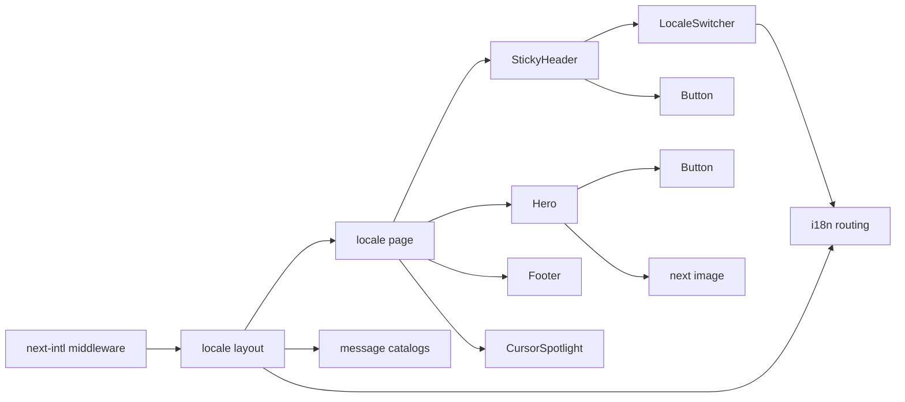

# Design Document — personal-landing

## Overview

**Purpose**: Deliver a one-page bilingual landing site that converts a warm visitor — arriving from LinkedIn, a referral, or a business card — into a single high-intent action: an email to `sanmartingoyanesfrancisco@gmail.com`. Every component below exists to make that conversion fast, accessible, and frictionless in two locales.

**Users**: Non-technical founders, PMs, and operators who land on `/` (English) or `/es` (Spanish) and need to understand who Fran is and how to reach him within five seconds. The visitor's only required action is a single click on a `Contact me →` button.

**Impact**: Establishes the canonical URL for Fran Sanmartín's outbound and referral traffic. Replaces "no public landing page" with a server-rendered, statically optimized Next.js 15 site deployed on Vercel behind Cloudflare. No backend, no database, no analytics, no cookie banner.

### Goals

- Render a single landing page in two locales (`/` EN, `/es` ES) with shared structure and content parity.
- Drive a single `mailto:` CTA with locale-translated subject, exposed both as a persistent sticky-header CTA reachable from every scroll position and as the primary visual CTA in the Hero below the pitch.
- Hit Lighthouse Performance ≥ 90 on mobile, LCP ≤ 2.0s, CLS < 0.1, with no render-blocking CSS or JS.
- Comply with WCAG 2.1 AA contrast, keyboard navigation, and semantic-landmark requirements.
- Render a subtle cursor-following spotlight on desktop, gated by `pointer: fine` and `prefers-reduced-motion`.
- Ship without any third-party tracking, cookies, or external data exfil.

### Non-Goals

- Multi-page navigation, blog, CMS, portfolio, or case studies.
- Lead-capture forms, newsletter signup, or scheduling embeds.
- Authentication, persistence, API routes, or any backend service.
- Analytics, tracking pixels, or marketing tags of any kind.
- Per-locale Open Graph image generators (a single shared brand OG image is sufficient for v1).
- Automated test suite (per steering: visual review + tooling-based audits in v1).

## Boundary Commitments

### This Spec Owns

- The landing page composition rendered at `/` (EN) and `/es` (ES).
- The `[locale]` route segment, its layout, and its `generateMetadata` per locale.
- The sticky top header (`StickyHeader` in `components/layout/`) and the page sections (`Hero`, `Footer`).
- The two client components: `CursorSpotlight`, `LocaleSwitcher`.
- The shadcn-derived `Button` UI primitive and the `cn` Tailwind class merger.
- The `next-intl` routing config (`src/i18n/routing.ts`, `src/i18n/request.ts`) and the locale middleware.
- The English and Spanish message catalogs in `messages/en.json` and `messages/es.json`.
- Site-wide metadata: `<title>`, `<meta name="description">`, Open Graph fields, `hreflang` alternates, canonical URLs, sitemap, and robots.
- Static assets: Fran's photo (`public/fran.jpg`), shared OG image (`public/og.png`), favicon.
- TypeScript strict configuration, Tailwind config, and Next.js config.

### Out of Boundary

- DNS, TLS, and CDN routing — owned by Vercel + Cloudflare configuration outside this repository.
- Email transport — the visitor's local mail client handles it once `mailto:` fires. The Site does not send mail.
- Third-party analytics, tracking, A/B testing, or marketing pixels (forbidden by R9).
- Any future blog, portfolio, case-study, scheduling, or CMS surface (deferred to a future spec, if ever).
- Form handling, lead capture, or any backend endpoint (forbidden by R2.5 / R2.7).
- Programmatic per-locale Open Graph image generation (deferred — see research.md).

### Allowed Dependencies

- **Runtime**: Next.js 15 (App Router), React 19, TypeScript 5+ (strict mode).
- **Locale**: `next-intl` v4 (locale routing, middleware, message resolution, navigation helpers).
- **Styling**: Tailwind CSS, `clsx`, `tailwind-merge` (combined as `cn`).
- **UI primitives**: shadcn/ui `Button` (copy-pasted into `src/components/ui/`), `lucide-react` icons.
- **Typography**: `next/font` (self-hosted Google or local font; see research.md).
- **Image**: `next/image` (built-in).
- **Deployment**: Vercel (build + hosting), Cloudflare (DNS + CDN front).
- **No other npm dependencies may be added without a one-line justification, per steering `tech.md`.**

### Revalidation Triggers

If any downstream spec or future change does the following, this design's boundary commitments must be re-checked before merging:

- Adds a new route, page, or locale beyond `/` and `/es` → invalidates the single-page assumption and the `as-needed` locale prefix decision.
- Introduces analytics, tracking, third-party scripts, or external network requests during page load → invalidates R9 commitments and the "no cookie banner" simplification.
- Replaces `mailto:` with a form, modal, or scheduling embed → invalidates R2.5 / R2.7 and the no-backend posture.
- Replaces shared static OG with per-locale programmatic OG → re-evaluate `app/[locale]/opengraph-image.tsx`.
- Changes the contact email recipient → update Canonical Content in `requirements.md` and message catalogs.
- Bumps `next-intl` to a major version with breaking middleware API changes → re-validate routing config and locale switcher.

## Architecture

### Architecture Pattern & Boundary Map

**Selected pattern**: Server-rendered React with minimal client islands. All sections render server-side at build time; only the cursor spotlight and the locale switcher hydrate as client components. This keeps the JS payload tiny (LCP-friendly), supports a JS-disabled fallback (R6.7), and matches steering's "Server Components by default" stance.



**Architecture Integration**:

- **Selected pattern**: Server-rendered + minimal client islands. Rationale: smallest JS payload, best LCP, satisfies R6.7 (JS-disabled fallback) for the value prop and `mailto:`.
- **Domain/feature boundaries**: The page is composed from one layout shell (StickyHeader, sticky-positioned at the top with z-index above the spotlight overlay) and two presentational sections (Hero, Footer), plus two client islands (CursorSpotlight, LocaleSwitcher). The i18n config is the only stable cross-cutting concern.
- **Existing patterns preserved**: This is greenfield; no existing patterns to honor beyond steering (`structure.md`).
- **New components rationale**: Each section maps to a distinct user-visible region. CursorSpotlight is the only animation surface; LocaleSwitcher is the only stateful UI. No abstraction layer above the sections — they compose directly in `page.tsx`.
- **Steering compliance**: Flat file structure, server components by default, no global state, no API routes — all consistent with `structure.md`.

### Dependency Direction

Imports flow strictly leftward; no upward imports are allowed:

```
i18n/routing  ←  lib/cn  ←  components/ui  ←  components/interactive  ←  {components/layout, components/sections}  ←  app
```

- `i18n/routing.ts` and `lib/cn.ts` may be imported by any layer.
- `components/ui/button.tsx` may import from `lib/cn.ts` and `i18n` only.
- `components/interactive/*` (CursorSpotlight, LocaleSwitcher) may import from `ui`, `lib`, `i18n`.
- `components/layout/*` (StickyHeader) and `components/sections/*` (Hero, Footer) may import from `interactive`, `ui`, `lib`, `i18n`. They sit at the same layer and must not import from each other.
- `app/**` (layouts, pages) may import from anything below.
- A layout or section component must never import a page; an interactive component must never import a layout or section.

### Technology Stack

| Layer | Choice / Version | Role in Feature | Notes |
|-------|------------------|-----------------|-------|
| Frontend framework | Next.js 15 (App Router) | Server-rendered React, static generation, image optimization, font self-hosting | Locked by steering. Default rendering on Vercel; no `output: 'export'`. |
| Language | TypeScript 5+ (strict) | Type safety across components, props, message keys | `any` forbidden per steering. |
| Styling | Tailwind CSS | Utility-first styling, responsive breakpoints, design tokens | Steering-locked. Tailwind plugin for class sorting via Prettier. |
| UI primitives | shadcn/ui `Button` | Single primitive copy-pasted into `src/components/ui/button.tsx` | Owned in-repo; not an npm dep. |
| Icons | `lucide-react` | Optional inline icons (e.g., locale switcher chevron, CTA arrow alternative) | Already implied by steering. |
| Locale routing | `next-intl` v4 | Path-prefix routing, middleware, message resolution, `useTranslations`, navigation helpers | `localeDetection: false` to satisfy R3.5. |
| Typography | `next/font` (self-hosted) | Self-hosted font assets at build time; no Google Fonts CDN request | Required to satisfy R9 (no third-party endpoints). |
| Image | `next/image` | Responsive AVIF/WebP, `priority` on the hero photo, explicit dimensions to prevent CLS | Built-in; no extra dep. |
| Hosting / CDN | Vercel + Cloudflare | Static generation + edge delivery; DNS/TLS via Cloudflare in front of Vercel | Out of this spec's boundary. |

## File Structure Plan

### Directory Structure

```
src/
├── app/
│   ├── [locale]/
│   │   ├── layout.tsx          # <html lang>, <body>, font, NextIntlClientProvider, generateMetadata per locale
│   │   ├── page.tsx            # Composes <StickyHeader /> + <Hero /> + <Footer /> + <CursorSpotlight />
│   │   └── not-found.tsx       # Minimal 404 inside the locale segment (optional in v1)
│   ├── globals.css             # Tailwind directives + spotlight overlay rule (uses --mx, --my)
│   ├── icon.svg                # Favicon (Next.js conventional file)
│   ├── robots.ts               # Generates /robots.txt — allows all, points at sitemap
│   └── sitemap.ts              # Generates /sitemap.xml with both locale URLs
├── components/
│   ├── layout/
│   │   └── StickyHeader.tsx    # Server component shell, sticky at top, hosts <LocaleSwitcher /> + persistent <Button /> CTA. Height ≤64px desktop / ≤56px mobile. z-index above CursorSpotlight.
│   ├── sections/
│   │   ├── Hero.tsx            # Photo (next/image, priority) + name + tagline + pitch + primary <Button /> CTA
│   │   └── Footer.tsx          # Visible email fallback (selectable text) + copyright. No CTA — sticky header carries the persistent CTA.
│   ├── interactive/
│   │   ├── CursorSpotlight.tsx # Client island: rAF + matchMedia gating + CSS variable writes
│   │   └── LocaleSwitcher.tsx  # Client island: locale toggle via next-intl/navigation
│   └── ui/
│       └── button.tsx          # shadcn/ui Button primitive (lowercase per shadcn convention)
├── i18n/
│   ├── routing.ts              # locales, defaultLocale, localePrefix, localeDetection: false
│   └── request.ts              # getRequestConfig for next-intl (loads messages/{locale}.json)
└── lib/
    └── cn.ts                   # clsx + tailwind-merge helper

messages/
├── en.json                     # All EN strings: hero copy, CTA label, mailto subject, footer, metadata
└── es.json                     # All ES strings (parallel structure to en.json)

public/
├── fran.jpg                    # Hero photo (placeholder acceptable in v1; final asset before launch)
└── og.png                      # Shared social preview image (1200×630 brand image)

middleware.ts                   # next-intl middleware at project root
next.config.ts                  # withNextIntl plugin wrapper
tailwind.config.ts              # Tailwind config (content paths, theme tokens)
postcss.config.mjs              # PostCSS + Tailwind plugin
tsconfig.json                   # strict: true, "@/*" path alias to ./src/*
package.json                    # pnpm scripts: dev, build, start, lint
.gitignore
README.md
```

### Modified Files

- None — greenfield. The current repository contains only `.kiro/` and `CLAUDE.md`. Every file above is created in this spec's implementation.

> Each file has a single responsibility. Files that change together (e.g., `messages/en.json` + `messages/es.json`) live in the same directory. The pattern repeats only across locale catalogs (one JSON per locale, structurally parallel).

## Requirements Traceability

| Requirement | Summary | Components | Interfaces / Contracts | Notes |
|-------------|---------|------------|------------------------|-------|
| 1.1, 1.2 | Above-the-fold content on desktop & mobile | `Hero` | `next/image` `priority` + `sizes`; Tailwind responsive utilities | Photo + name + tagline + pitch + CTA reachable on first viewport |
| 1.3, 1.4, 1.5 | StoryBrand structure & canonical content | `Hero`, `messages/{locale}.json` | Message keys: `hero.name`, `hero.tagline`, `hero.pitch` | Source-of-truth strings live in the catalog |
| 2.1, 2.2 | `mailto:` with prefilled recipient + translated subject | `Hero`, `Footer`, `Button`, `messages/{locale}.json` | Message keys: `cta.label`, `cta.subject`, `contact.email` | Subject translated per locale; recipient constant |
| 2.3, 2.4 | CTA persistently reachable on every render (sticky header) + primary visual CTA in Hero | `StickyHeader`, `Hero` | Shared `Button` primitive renders both instances with identical `mailto:` href | Sticky header satisfies "always reachable" intent of R2.4 (strictly more reachable than a single bottom repeat); Hero retains the primary visual conversion point |
| 2.5, 2.7 | No forms, no intermediate steps | `page.tsx` composition | N/A — absence is the contract | Reviewer scans the tree for input elements; none should exist |
| 2.6 | Email visible as selectable text fallback | `Footer` | Message key: `contact.email` rendered as `<address>` | Provides copy-paste path |
| 3.1, 3.2 | EN at `/`, ES at `/es` | `[locale]/page.tsx`, `i18n/routing.ts`, `middleware.ts` | next-intl middleware + `localePrefix: 'as-needed'` | Path-prefix routing |
| 3.3 | Translate every user-facing string incl. mailto subject and metadata | `messages/en.json`, `messages/es.json`, `[locale]/layout.tsx` `generateMetadata` | All copy lives in catalogs; no hardcoded strings in JSX | Parallel catalog structure |
| 3.4 | Locale switcher visible on every render | `StickyHeader`, `LocaleSwitcher` | Top-right placement inside sticky header on all viewports | Reachable via Tab order at every scroll position |
| 3.5 | No browser-language auto-redirect | `i18n/routing.ts` | `localeDetection: false` | Explicit configuration |
| 3.6 | Switcher navigates to equivalent locale page | `LocaleSwitcher` | `next-intl/navigation` `Link` / `useRouter` | Locale-aware navigation |
| 3.7 | Same value prop & CTA target in both locales | `messages/{locale}.json` | Catalog parity contract | Reviewer compares both files for structural equality |
| 3.8 | `<html lang>` declares active locale | `[locale]/layout.tsx` | `<html lang={locale}>` derived from route param | Updates per locale |
| 4.1, 4.2, 4.3 | Mobile vertical / tablet intermediate / desktop horizontal layout | `Hero` | Tailwind breakpoint utilities (`md:`, `lg:`) | Photo top on mobile, side on desktop |
| 4.4 | No horizontal scroll | Site-wide CSS | `overflow-x: clip` on body; max-width container | Verified via DevTools at 320px |
| 4.5 | Touch targets ≥ 44×44 CSS px on touch devices | `StickyHeader` (header CTA + LocaleSwitcher), `Hero` (hero CTA) | Tailwind sizing tokens enforce min `h-11 w-11` (44 px) on Button and LocaleSwitcher | Applies to all three interactive surfaces |
| 4.6 | Body / CTA text readable at 320 px without zoom | `Hero`, `Footer`, Tailwind config | Type scale starts at 16 px base; line height ≥ 1.5 | Verified via DevTools |
| 4.7 | Live resize without breakage | Tailwind responsive utilities | Fluid spacing tokens, no fixed-px widths | Manual resize check |
| 4.8 | Footer with copyright in all viewport ranges | `Footer`, `messages/{locale}.json` | Message key: `footer.copyright` | Always renders at page bottom |
| 5.1 | Spotlight follows cursor on desktop | `CursorSpotlight`, `globals.css` | rAF-driven CSS custom property writes | See Components section |
| 5.2 | Disabled on touch-only devices | `CursorSpotlight` | `matchMedia('(hover: hover) and (pointer: fine)')` gate | No listener attached on touch |
| 5.3 | Respect `prefers-reduced-motion` | `CursorSpotlight` | `matchMedia('(prefers-reduced-motion: reduce)')` gate | No animation when reduced motion |
| 5.4 | Non-blocking overlay | `globals.css` | `pointer-events: none` on overlay | CTA always activatable |
| 5.5 | 60fps on modern hardware | `CursorSpotlight` | rAF throttle | Verified via DevTools Performance |
| 6.1 | LCP ≤ 2.0s on 4G mobile | `Hero` | `next/image` `priority` on photo | Photo is the LCP element |
| 6.2 | Lighthouse Performance ≥ 90 mobile | Site-wide | Composite of all perf decisions | Audit on production build |
| 6.3 | CLS < 0.1 | `Hero`, `next/image`, `next/font` | Explicit `width` + `height` on image; `display: 'swap'` on font; aspect-ratio reserved | No mid-load layout shift |
| 6.4 | No render-blocking CSS / JS | Tailwind, `next/font` | Tailwind generates a single CSS file Next.js inlines critical chunks; `next/font` self-hosts | Default Next.js behavior |
| 6.5 | Server-render value prop, photo, switcher, CTA | `[locale]/layout.tsx`, `[locale]/page.tsx` | All except `CursorSpotlight` and `LocaleSwitcher` are server components | Verified by absence of `"use client"` in `StickyHeader`, `Hero`, `Footer` |
| 6.6 | Viewport-matched photo delivery | `Hero` | `next/image` `sizes` attribute | Vercel selects AVIF/WebP per request |
| 6.7 | Functional with JS disabled (read + activate `mailto:`) | `StickyHeader`, `Hero`, `Footer` | Sticky header uses CSS `position: sticky` (no JS); all sections render server-side; `mailto:` and visible email work without JS | LocaleSwitcher degrades to a plain link list (see Components section) |
| 7.1 | WCAG 2.1 AA contrast | Tailwind theme | Color tokens chosen against background; verified with contrast checker | Theme-level decision |
| 7.2 | Keyboard navigation with visible focus | `Button`, `LocaleSwitcher` | Tailwind `focus-visible:` utilities; default browser focus ring not suppressed | Tab order reaches switcher then CTA |
| 7.3 | Descriptive alt text for photo | `Hero`, `messages/{locale}.json` | Message key: `hero.photoAlt` | Translated per locale |
| 7.4 | Semantic landmarks (`<h1>`, `<main>`, `<footer>`) | `[locale]/page.tsx`, `Hero`, `Footer` | Single `<h1>` in Hero; `<main>` wrapping page; `<footer>` in Footer | Enforced in JSX |
| 7.5 | `<html lang>` updates per locale | `[locale]/layout.tsx` | Same as 3.8 | Single source |
| 8.1 | Per-locale `<title>` + meta description | `[locale]/layout.tsx` `generateMetadata` | Message keys: `meta.title`, `meta.description` | Locale-aware metadata |
| 8.2 | Open Graph metadata for both locales | `[locale]/layout.tsx` `generateMetadata` | OG fields: title, description, image, url, siteName | Image is shared `/public/og.png` |
| 8.3 | `hreflang` alternates linking EN ↔ ES | `[locale]/layout.tsx` `generateMetadata` | `alternates.languages` field | Both locales cross-reference |
| 8.4 | Canonical URL per locale | `[locale]/layout.tsx` `generateMetadata` | `alternates.canonical` field | One per locale page |
| 9.1 | No third-party analytics / ads / marketing tags | Site-wide composition | Reviewer scans `<head>` and `<body>` for any external script | Absence is the contract |
| 9.2 | No tracking cookies / storage | Site-wide composition | No `document.cookie` write, no `localStorage` / `sessionStorage` write | Absence is the contract |
| 9.3 | No external endpoints as page-load side effect | Site-wide composition; `next/font` self-hosted | Verified by Network tab — only first-party requests | Absence is the contract |
| 9.4 | No cookie banner / consent dialog | Site-wide composition | None rendered | Earned because R9.1–9.3 hold |

## Components and Interfaces

### Summary

| Component | Domain/Layer | Intent | Req Coverage | Key Dependencies (P0/P1) | Contracts |
|-----------|--------------|--------|--------------|--------------------------|-----------|
| `[locale]/layout.tsx` | App | Root locale layout, `<html lang>`, font, providers, metadata | 3.8, 6.5, 7.5, 8.1, 8.2, 8.3, 8.4 | next-intl `getMessages` (P0), `next/font` (P0) | State |
| `[locale]/page.tsx` | App | Compose StickyHeader + Hero + Footer + CursorSpotlight | 1.1, 1.2, 6.5, 6.7, 7.4 | StickyHeader, sections, CursorSpotlight (P0) | — |
| `StickyHeader` | UI / Layout | Sticky top bar hosting LocaleSwitcher and persistent CTA | 2.3, 2.4, 3.4, 4.5, 6.5, 6.7 | LocaleSwitcher (P0), `Button` (P0), `useTranslations` (P0) | — |
| `Hero` | UI / Section | Photo + name + tagline + pitch + primary CTA | 1.1–1.5, 2.1–2.4, 4.1–4.3, 6.1, 6.3, 6.6, 7.3, 7.4 | `next/image` (P0), `Button` (P0), `useTranslations` (P0) | — |
| `Footer` | UI / Section | Visible email fallback + copyright (no CTA — replaced by sticky header) | 2.6, 4.8 | `useTranslations` (P0) | — |
| `CursorSpotlight` | UI / Interactive | Cursor-following radial-gradient overlay on desktop | 5.1–5.5 | Browser `matchMedia` + `requestAnimationFrame` (P0) | State |
| `LocaleSwitcher` | UI / Interactive | Bilingual locale toggle | 3.4, 3.6, 7.2 | `next-intl/navigation` `useRouter` + `usePathname` (P0) | State |
| `Button` | UI / Primitive | shadcn/ui Button — used by both CTAs | 2.1, 2.3, 4.5, 7.2 | `cn` (P0) | — |
| `i18n/routing.ts` | Config | next-intl routing definition | 3.1, 3.2, 3.5 | next-intl/routing (P0) | Service |
| `i18n/request.ts` | Config | next-intl request config; loads message catalog per locale | 3.1, 3.2, 3.3 | next-intl/server (P0), `messages/*.json` (P0) | Service |
| `middleware.ts` | Routing | next-intl middleware at project root | 3.1, 3.2, 3.5 | `i18n/routing.ts` (P0) | Service |
| `messages/{locale}.json` | Content | All translatable strings per locale | 1.4, 2.2, 3.3, 3.7, 4.8, 7.3, 8.1 | — | — |

The summary above is the authoritative component map. Detailed blocks below are provided only for the four components that introduce new boundaries: `StickyHeader`, `CursorSpotlight`, `LocaleSwitcher`, and the i18n routing config. Presentational components (`Hero`, `Footer`, `Button`, layouts, pages) follow conventional Next.js + Tailwind patterns and do not require separate contracts beyond the message-catalog dependency listed above.

### Layout

#### StickyHeader

| Field | Detail |
|-------|--------|
| Intent | Provide a top-of-page sticky bar — always visible across all scroll positions and viewport ranges — that hosts the locale switcher and a persistent contact CTA. |
| Requirements | 2.3, 2.4, 3.4, 4.5, 6.5, 6.7 |

**Responsibilities & Constraints**

- Renders as a server component shell with `position: sticky; top: 0` and a z-index strictly higher than the `CursorSpotlight` overlay so the CTA is never visually obscured by the gradient.
- Layout: empty or minimal text-only wordmark on the left (no logo file in v1); locale switcher and persistent CTA stacked on the right.
- Maximum height: 64 px on viewports ≥ 1024 px; 56 px on viewports < 1024 px. Preserves above-the-fold real estate for the Hero.
- Hosts the `LocaleSwitcher` client island and a `Button` instance whose `mailto:` href and translated subject are identical to the Hero CTA. Single source of message keys; no duplicated content strings.
- Mobile CTA scaling: on viewports < 480 px the header CTA may shrink to a shorter localized label (e.g., `Contact →`) or to an icon-only button while preserving 44×44 px touch targets. Whichever variant ships, `aria-label` always carries the full localized "Contact me" phrase. Decision finalized during implementation via visual review at 320 px width.
- Tab order inside the header on every render: locale switcher → CTA. Combined page Tab order: locale switcher → header CTA → hero CTA (when scrolled to Hero).
- Functions without JavaScript: CSS `position: sticky` is the entire stickiness mechanism; no scroll listeners or JS required. Satisfies R6.7 by construction.

**Dependencies**

- Inbound: `[locale]/page.tsx` (P0).
- Outbound: `LocaleSwitcher` (P0), `Button` (P0), `useTranslations` for label and `mailto:` subject (P0).
- External: none beyond `next-intl`.

**Contracts**: — (no service / API / event / batch / state contract beyond rendered DOM)

**Implementation Notes**

- Integration: Mounted at the top of `[locale]/page.tsx` so it overlays content cleanly via sticky positioning. Its z-index sits above the `CursorSpotlight` overlay.
- Validation:
  - Scroll `/` and `/es` top → bottom: header remains pinned; CTA remains clickable at every scroll position.
  - DevTools Computed: `position: sticky` on the header, computed `z-index` higher than the spotlight overlay.
  - Disable JavaScript in DevTools and verify: header still pins, CTA still opens `mailto:`, locale links still navigate.
  - Tab from page top: focus lands on locale switcher first, then header CTA. After scrolling and tabbing further, focus reaches the Hero CTA.
- Risks: Mobile content stacking on 320 px viewports — if the header is too cramped, fall back to icon-only CTA per the scaling rule above.

### Interactive

#### CursorSpotlight

| Field | Detail |
|-------|--------|
| Intent | Render a soft radial-gradient glow that tracks the visitor's cursor on desktop, gated by hover/pointer + reduced-motion media queries. |
| Requirements | 5.1, 5.2, 5.3, 5.4, 5.5 |

**Responsibilities & Constraints**

- Renders a single fixed-position overlay `<div>` that occupies the full viewport.
- Listens to `pointermove` only when `(hover: hover) and (pointer: fine)` matches and `prefers-reduced-motion: reduce` does NOT match.
- Throttles updates via `requestAnimationFrame` so at most one style write occurs per frame.
- Writes two CSS custom properties (`--mx`, `--my`) on the overlay element; the radial gradient is defined in `globals.css` and consumes these variables.
- Sets `pointer-events: none` on the overlay so it never intercepts clicks or text selection.
- Cleans up listeners and the rAF handle on unmount.

**Dependencies**

- Inbound: composed once by `[locale]/page.tsx` (P0).
- Outbound: none.
- External: Browser `window.matchMedia`, `requestAnimationFrame`, `pointermove` event (P0).

**Contracts**: State [x]

##### State Management

```typescript
// Conceptual contract — actual implementation is a small client component
interface CursorSpotlightProps {
  /** Optional dampening factor for cursor follow; default = 1 (no easing). */
  readonly responsiveness?: number;
}

// Internal state (refs only — no React state to avoid re-renders)
type SpotlightState = {
  readonly overlay: HTMLDivElement | null;
  readonly latest: { x: number; y: number };
  readonly rafId: number | null;
};
```

- **State model**: Refs only. No React state. No re-renders triggered by cursor movement.
- **Persistence & consistency**: None — state is ephemeral, lives only while mounted.
- **Concurrency strategy**: At most one rAF tick scheduled at a time; overlapping pointer events coalesce to the latest position.

**Implementation Notes**

- Integration: Mounted once in `[locale]/page.tsx` outside the `<main>` landmark. Renders as a sibling overlay; does not affect the document flow.
- Validation:
  - Verify the overlay is hidden (display: none or not rendered) when `(hover: hover) and (pointer: fine)` does not match.
  - Verify no `pointermove` listener is attached on touch-only devices (DevTools event listeners panel).
  - Verify Performance panel shows ≤ 16.6 ms per frame during continuous cursor movement.
  - Verify `pointer-events: none` is computed on the overlay (DevTools Computed tab).
- Risks: Profile-based jank fallback (see research.md) is deferred until measurements demand it.

#### LocaleSwitcher

| Field | Detail |
|-------|--------|
| Intent | Toggle between English and Spanish locales while preserving the equivalent page URL. |
| Requirements | 3.4, 3.6, 7.2 |

**Responsibilities & Constraints**

- Renders a focusable control that displays the inactive locale and navigates to it on activation.
- Uses `next-intl/navigation` helpers (`useRouter`, `usePathname`) so URL transitions are locale-aware and SSR-safe.
- Reaches a 44×44 CSS-pixel touch target on all viewports (R4.5).
- Exposes a visible `:focus-visible` ring (R7.2).
- Degrades gracefully when JavaScript is disabled: the rendered fallback is a pair of plain `<a>` elements — one for `/`, one for `/es` — with the inactive one visually emphasized. This satisfies R6.7 because locale navigation remains possible without JS.

**Dependencies**

- Inbound: rendered by `StickyHeader` (P0).
- Outbound: `i18n/routing.ts` (P0) — for the locale list.
- External: `next-intl/navigation` (P0).

**Contracts**: State [x]

##### State Management

```typescript
interface LocaleSwitcherProps {
  /** No props; the component reads the active locale from next-intl context. */
}

// Conceptual outline — the component is a thin wrapper around next-intl helpers
type LocaleSwitcherInternals = {
  readonly currentLocale: 'en' | 'es';
  readonly nextLocale: 'en' | 'es';
  readonly currentPathname: string;
};
```

- **State model**: Reads `useLocale()` from `next-intl`. Computes the inactive locale and the current pathname stripped of its locale prefix.
- **Persistence & consistency**: None. Locale is derived from URL; URL is the source of truth.
- **Concurrency strategy**: Single click → single navigation. No optimistic state.

**Implementation Notes**

- Integration: Mounted in `StickyHeader`. Visible at top-right of every page render across all viewports, and persistently visible at every scroll position via the sticky-header.
- Validation:
  - Tab order: `LocaleSwitcher` is reached first, before the header CTA and the hero CTA.
  - Clicking from `/foo/bar` (hypothetical future path) should land on `/es/foo/bar` — verify with `next-intl/navigation` semantics.
  - With JS disabled, both locales remain navigable via plain anchor fallback.
- Risks: If `next-intl` v4 introduces a breaking change to `useRouter` return shape, lock the version in `package.json` and re-validate on upgrade.

### Config / Routing

#### i18n routing config

| Field | Detail |
|-------|--------|
| Intent | Single source of truth for locale list, default locale, path-prefix strategy, and locale-detection policy. |
| Requirements | 3.1, 3.2, 3.5 |

**Responsibilities & Constraints**

- Declares `locales: ['en', 'es']` and `defaultLocale: 'en'`.
- Sets `localePrefix: 'as-needed'` so the default locale serves at `/` and Spanish at `/es`.
- Sets `localeDetection: false` to disable Accept-Language auto-redirect (R3.5).
- Exposes the navigation helpers re-exported from `next-intl/navigation` typed against this config.
- Imported by `middleware.ts`, `i18n/request.ts`, `LocaleSwitcher`, and `[locale]/layout.tsx`.

**Dependencies**

- Inbound: `middleware.ts` (P0), `i18n/request.ts` (P0), `LocaleSwitcher` (P0), `[locale]/layout.tsx` (P0).
- Outbound: none — pure config.
- External: `next-intl/routing`, `next-intl/navigation` (P0).

**Contracts**: Service [x]

##### Service Interface

```typescript
import { defineRouting } from 'next-intl/routing';
import { createNavigation } from 'next-intl/navigation';

export const routing = defineRouting({
  locales: ['en', 'es'] as const,
  defaultLocale: 'en',
  localePrefix: 'as-needed',
  localeDetection: false,
});

export type Locale = (typeof routing.locales)[number];

export const { Link, redirect, usePathname, useRouter } = createNavigation(routing);
```

- **Preconditions**: None (pure config, evaluated at module load).
- **Postconditions**: Exports a typed `routing` object and locale-aware navigation helpers consumed across the spec.
- **Invariants**: `locales[0]` is always the default locale; adding a third locale requires updating `messages/`, `generateMetadata`, and the LocaleSwitcher UI in tandem (revalidation trigger).

**Implementation Notes**

- Integration: `middleware.ts` consumes `routing` to wire the locale middleware. `i18n/request.ts` consumes it to load the right message catalog per request.
- Validation:
  - Verify `/` returns the EN page and `/es` returns the ES page (manual cURL or browser).
  - Verify visiting `/` with `Accept-Language: es` does not redirect (because `localeDetection: false`).
  - Verify the `LocaleSwitcher` produces correct hrefs for both directions.
- Risks: A future `next-intl` major bump may rename or restructure `defineRouting` / `createNavigation`. Pin the major version in `package.json` and re-test routing after any upgrade.

## Error Handling

This site has minimal error surfaces because there is no backend, no form, and no user-supplied input.

### Error Strategy

- **Routing miss** (visitor hits an unknown path under `/` or `/es`): Render the locale-aware `not-found.tsx` fallback inside `[locale]/`. The page should display a brief locale-translated message and a link back to the locale root. v1 may rely on Next.js's default `not-found` if a translated fallback is deferred.
- **Asset miss** (e.g., `fran.jpg` not yet replaced): The `next/image` `alt` text remains; the empty image area is replaced by the alt during loading failure. This is acceptable in v1 because the placeholder is always present.
- **`mailto:` not handled by the OS** (visitor has no default mail client): R2.6 requires Fran's email address to be visible as selectable text; the Footer renders it as an `<address>` element so the visitor can copy it manually.
- **Locale message key missing**: next-intl raises a runtime error in development. Build-time validation: verify `messages/en.json` and `messages/es.json` have structurally parallel keys before merge (a simple key-diff in a pre-commit script may be added later but is not in v1 scope).

### Monitoring

- v1: none. Per R9, the site emits no telemetry, no error reporting, no analytics. If the site stops working, Fran finds out by visiting the URL or by losing inbound emails. This is acceptable for the traffic volume and scope.

## Testing Strategy

Per steering `tech.md`, no automated test suite ships in v1. "Visual review is the test." This section therefore captures the **verification strategy** that supplements visual review with deterministic tooling-based audits before each deploy.

### Verification Items

- **Visual review per requirement**: Run through the 9 requirements' acceptance criteria as a manual checklist on the staging URL and on the production URL. Both EN and ES locales must be checked.
- **Lighthouse audit (mobile profile, production build)**:
  - Performance ≥ 90 (R6.2)
  - LCP ≤ 2.0 s (R6.1)
  - CLS < 0.1 (R6.3)
  - No render-blocking resources flagged (R6.4)
- **Accessibility scan** (axe DevTools or `@axe-core/cli` against the deployed URL):
  - Zero serious or critical violations.
  - WCAG 2.1 AA contrast pass on body, headings, CTA label, and locale switcher (R7.1).
  - Keyboard-only walkthrough: Tab reaches the locale switcher and both CTA instances; visible focus ring on each (R7.2).
- **Responsive matrix** (Chrome DevTools device toolbar + at least one real iOS Safari and one real Android Chrome):
  - 320×568, 375×667, 414×896 → vertical layout, no horizontal scroll (R4.1, R4.4).
  - 768×1024, 820×1180 → intermediate layout (R4.2).
  - 1024×768, 1280×720, 1920×1080 → horizontal layout (R4.3).
  - Live resize from 1280 → 320 in DevTools without layout breakage (R4.7).
- **Spotlight verification**:
  - Desktop with mouse: cursor follows, smooth, no jank (R5.1, R5.5).
  - Touch device or browser DevTools "Touch" mode: no spotlight rendered (R5.2).
  - DevTools → Rendering → "Emulate CSS media feature `prefers-reduced-motion: reduce`" → no animation (R5.3).
  - DevTools Console: hover the CTA and click — interaction not blocked (R5.4).
- **JS-disabled smoke test** (Chrome DevTools → Settings → Disable JavaScript):
  - Hero, Footer, photo, locale links, primary CTA all readable and activatable (R6.7).
- **Privacy verification** (DevTools Network tab, fresh cold load):
  - Only first-party requests (Vercel/Cloudflare-served) — no Google Fonts, no Vercel Analytics, no third-party endpoints (R9.1, R9.3).
  - DevTools → Application → Cookies / Storage: empty (R9.2).
- **SEO verification**:
  - `<title>` and `<meta name="description">` differ between `/` and `/es` (R8.1).
  - View Source on both pages: Open Graph tags present, `hreflang` cross-references both locales, canonical URL set per locale (R8.2, R8.3, R8.4).
  - `/sitemap.xml` and `/robots.txt` resolve and reference both locales.
- **Content parity check**: Diff the structure of `messages/en.json` and `messages/es.json` — every key in EN must exist in ES (R3.7).

If any item fails, fix and re-run before promoting the build.

## Performance & Scalability

This section captures decisions specific to this feature's performance targets. Baseline practices (e.g., Next.js production builds, Vercel CDN) come from steering and are not restated.

### Targets (from R6)

- Lighthouse Performance score ≥ 90 on mobile profile
- LCP ≤ 2.0 s on a typical 4G mobile connection (cold cache)
- CLS < 0.1 across the full page load
- No render-blocking CSS or JavaScript

### Decisions

- **Hero photo**: Served via `next/image` with `priority={true}`, explicit `width` and `height`, and a `sizes` attribute matching the three breakpoints. The image is the LCP element; preloading it shaves the largest chunk of LCP time.
- **Fonts**: `next/font` self-hosted with `display: 'swap'` and `adjustFontFallback: true` (Next.js's default for Google fonts). Eliminates third-party font CDN, prevents FOUT from causing CLS.
- **JavaScript surface**: Only `CursorSpotlight` and `LocaleSwitcher` are client components. All other rendering is server-side. Total client JS budget targets ≤ 20 KB gzipped (Next.js framework + next-intl runtime + the two islands). If the budget is exceeded, profile and trim before merge.
- **Tailwind output**: Production build runs the Tailwind purger via `content` paths covering `src/**/*.{ts,tsx}`. The resulting CSS file is small and inlined as critical CSS by Next.js.
- **No animation library**: The cursor spotlight is hand-rolled to avoid a 30–60 KB animation runtime.
- **Sticky header**: Uses CSS `position: sticky` only — no JavaScript scroll handlers. Adds a single ~56–64 px element above the fold that does not impact LCP because the Hero photo remains the largest contentful element.
- **Deferred or skipped**:
  - View transitions: not needed for a single-page site.
  - Service worker / PWA: out of scope.
  - Resource hints beyond Next.js defaults: not needed; the spec is small enough that automatic preload covers the LCP path.

### Scalability

The site is statically generated and served from Vercel's CDN. Traffic scaling is not a v1 concern — the deployment platform handles it. There are no databases, caches, or stateful services to scale.

## Pre-Launch Verification Checklist

Each unchecked item is a deploy blocker. The checklist is the v1 verification gate; run it against the production build before promoting any deploy.

### Functional

- [ ] EN page at `/` renders all canonical content with no missing strings (R1.4, R3.1)
- [ ] ES page at `/es` renders all canonical content with no missing strings (R1.4, R3.2)
- [ ] Locale switcher navigates between `/` and `/es` and updates the URL (R3.5)
- [ ] No auto-redirect by browser language verified by setting browser locale to ES and visiting `/` — page still serves EN (R3.6)
- [ ] Header CTA opens default mail client with recipient `sanmartingoyanesfrancisco@gmail.com` and EN subject `Hi Fran` (R2.1, R2.2)
- [ ] Header CTA on `/es` opens mail client with same recipient and ES-translated subject (R2.2)
- [ ] Hero CTA behaves identically to header CTA in both locales (R2.1, R2.3)
- [ ] Email address visible as selectable text fallback on both locales (R2.6)
- [ ] No forms, no inputs, no calendar embeds anywhere on the page (R2.5, R2.7)
- [ ] Sticky header remains visible at every scroll position on `/` and `/es` (R2.3, R2.4)
- [ ] Catalog parity: every key in `messages/en.json` exists in `messages/es.json` with non-empty value (R3.7)
- [ ] `/sitemap.xml` resolves and references both `/` and `/es` (R8.3)
- [ ] `/robots.txt` resolves and allows crawling (R8 baseline)

### Responsive

- [ ] Mobile 375 px: vertical stack, full-width Hero CTA, sticky header collapses gracefully, no horizontal scroll (R4.1, R4.4)
- [ ] Tablet 820 px: intermediate layout renders without breakage (R4.2)
- [ ] Desktop 1280 px: horizontal Hero layout (photo left, content right) (R4.3)
- [ ] Manual resize from 320 px to 1920 px shows no layout breakage at the 768 / 1024 breakpoints (R4.7)
- [ ] Touch targets verified ≥ 44×44 CSS px in mobile DevTools profile for header CTA, hero CTA, and locale switcher (R4.5)
- [ ] Body copy and CTA label readable at 320 px without pinch-zoom (R4.6)

### Spotlight

- [ ] Mouse on desktop: spotlight follows cursor smoothly, no jank during rapid movement (R5.1, R5.5)
- [ ] iPhone (real device or iOS simulator): no spotlight rendered (R5.2)
- [ ] DevTools "Emulate CSS prefers-reduced-motion: reduce" disables spotlight motion (R5.3)
- [ ] Click-through verification: spotlight does not intercept clicks on text, header CTA, hero CTA, or switcher (R5.4)
- [ ] Sticky header CTA remains visually unobscured at every cursor position — z-index ordering correct (R5.4 + sticky-header layering)

### Accessibility

- [ ] Tab order on `/` and `/es`: locale switcher → header CTA → hero CTA (R7.2)
- [ ] Visible focus indicator on every focusable element (R7.2)
- [ ] axe DevTools scan: zero critical or serious violations on `/` and `/es` (R7.1, R7.4)
- [ ] Photo alt text descriptive in both locales (R7.3)
- [ ] HTML `lang` attribute is `en` on `/`, `es` on `/es` (R3.8, R7.5)
- [ ] Single `<h1>`, `<main>`, `<footer>` landmarks present and correctly nested (R7.4)

### Performance

- [ ] Lighthouse mobile Performance ≥ 90 on production build (R6.2)
- [ ] LCP ≤ 2.0 s on 4G mobile profile (R6.1)
- [ ] CLS < 0.1 on full page load (R6.3)
- [ ] No render-blocking CSS or JS visible in Network panel waterfall (R6.4)
- [ ] Photo served at viewport-appropriate resolution — verified in Network panel (R6.6)
- [ ] Page renders meaningfully with JS disabled in DevTools: copy, photo, locale links, header CTA `mailto:`, hero CTA `mailto:` all functional, sticky header still pinned (R6.7)

### SEO and link share

- [ ] `/` and `/es` each have unique `<title>` and `<meta name="description">` (R8.1)
- [ ] Open Graph metadata present on both locales — verified with a social preview tool (R8.2)
- [ ] `hreflang` tags link `/` ↔ `/es` bidirectionally (R8.3)
- [ ] Canonical URL declared per locale (R8.4)

### Privacy

- [ ] No third-party requests in Network panel beyond own domain (R9.1)
- [ ] View Source on both pages: zero `<script>` or `<link>` tags pointing at third-party domains (R9.1)
- [ ] No cookies, `localStorage`, or `sessionStorage` entries set after a full session — DevTools Application tab empty (R9.2, R9.3)
- [ ] No cookie banner or consent dialog rendered (R9.4)
